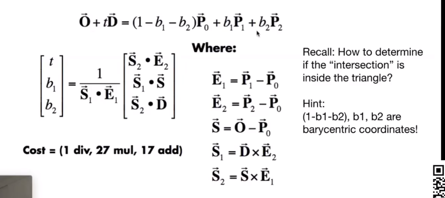
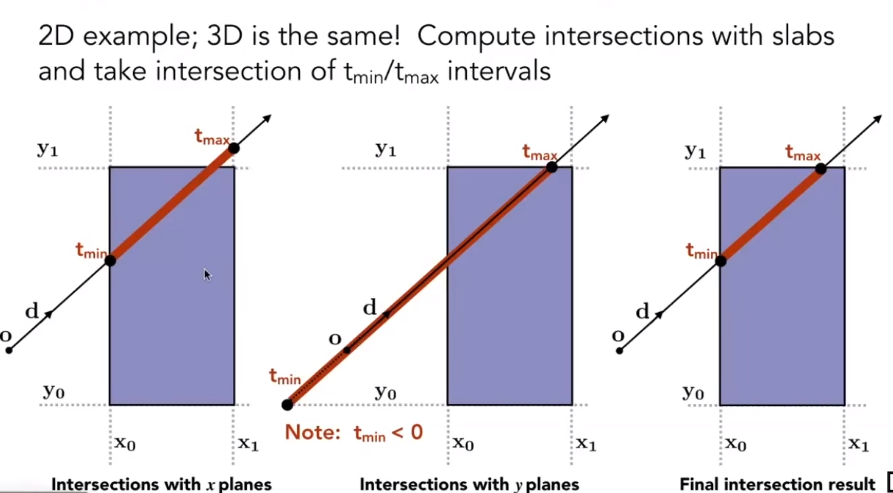

# Fundamental of Graphics
+ Background
  + Real Time
    + Frame per seconds
    + Refresh rates
+ OpenGL
  + from model to screen\
    
  + MVP matrix
    + ProjectionMatrix
      + orthognal or perspective
    + ViewMatrix
      + lookAt(camera position,rotation,direction)
    + ModelMatrix
    + P\*V\*M\*position    
+ Projections\
  + We wan to map a cubioid $[l,r]\times [b,t]\times[f,n]$ to the canoical cube $[-1,1]^3$
  + Orghographic Projection
  
  + Perspective Projection\
  $ M_{persp\rightarrow ortho}=\left( \begin{array}{cccc} 
                            n & 0 &0 & 0\\
                            0 &  n & 0& 0\\ 
                            0 & 0 & n+f &-nf\\
                            0 & 0 & 1 & 0
                        \end{array}\right) $
  + vertical field-of-view (fovY) and aspect ratio(assume symmetry l=-r,b=-t)\
    + aspect ratio = width/height = r/t
    $$ tan\frac{fovY}{2} = \frac{t}{|n|}$$
+ Rasterization
  + Canonical Cube to Screen
    + tranform in xy plane $[-1,1]^2$ to $[0,width]\times[0,height]$
  + LCD(Liquid Crystal Display) Pxiel
    + block or transmit light by twisting polarization
    + Illumination from backlight
    + Intermediate intensity levels by partial twist
  + Sampling
    + binary func: inside(tri,x,y)
      + equals 1 when pixel(x,y) inside triangle tri
        ```
        for (int x = 0; x < xmax; ++x)
          for (int y = 0; y < ymax; ++y)
              image[x][y] = inside(tri,x + 0.5,y + 0.5); 
        ```
      + Three Cross Product
      + Incremental triangle traversal
       
  + Antialiasing
    + Sampling Theory
      + Rasterization = sampling in 2D
      + behind aliasing artifacts:signals changes too fast(high-freq) but sampled too slowly
      + Blurring(Pre-Filtering) Before Sampling
      + 
       + Fourier Tranform
          + Series: represent a unction as a weighted sum of sines and cosines
          + Higher Frequencies need faster sampling
        + Filtering - Convolution
        + Sampling - repeating frequency contents
        + Supersampling MSAA
          + 
          + average NxN samples "inside" each pixel
        + FXAA
        + TAA
      + Visibility/Occulsion
        + Z-buffer
          + Painter's Algorithm
          + store current min z-value for each sample(pixel)
          + Additional buffer for depth values
          + z is always positive(smaller closer, larger further)
+ Shading
  + Applying material to an object
  + Shading is local
  + Blinn-Phong Refelctance Model
    + Lambert's cosine law\
      Light per unit area is proportional to $cos\theta = l\cdot n$
    + Intensity $I/r^2$
    + Lamberian(Diffuse) Shading
    
      $$L_d = k_d(I/r^2)max(0,n\cdot l)$$
      + $h = bisector(v,l)=\frac{v+h}{|v+h|}$, v close to mirror equals half vector near normal
      $$ L_s = k_s(I/r^2)max(0,cos\alpha)^p =k_s(I/r^2)max(0,n\dot h)^p$$
        + increasing narrows the reflection lobe
    + Ambient Term
      + Add costantcolor to account or disregardedillumination andfill in black shadows
      $$ L_a = k_aI_a$$
    
  + Shading Frequencies
    + Flat shaing
      + Triangle face is flat - one normal vector
      + not smooth
    + Gouraud shading
      + Interpolate colors froms vertices across triangle
      + Each vertex has avector
    + Phong shaidng
      + Interpolate normalvectors across each triangle
      + Compute full shading model at each pixel
+ Pipeline

  + Shader Programs
    + program vertex and fragment processing stages
    + Describe operation on a single vertex(or fragment)
    + shadertoy
+ Texture Mapping
  + Each triangle vertex is assigned a texture coordinate(u,v)
  + Texture can be used multiple times(tiled)
  + Interpolation across Triangles
    + Barycentric Coordinate
      + A coordinte system for triangles $(\alpha,\beta,\gamma)$
      $(x,y) = \alpha A +\beta B+ \gamma C,\alpha+\beta+\gamma=1$
        + inside the triangle if all three coordinates are non-negative
      + barycentric coordinates are note invariant under projection
  + Simple Texture Mapping
    ```
    for each rasterized screen sample (x,y):
        (u,v) = evaluae texture coordinate at(x,y)
        texcolor = texture.sample(u,v)\\usually diffuse albedo K_d
    ```
  + Texture Magnification
    + insufficient texture resolution
      + Bilinear interpolation
  + Too large - aliasing
    + from near to far :upsampling(magnification) to downsampling(minification)
    + Mipmap
      
      + allowing(fast,approx,square) range queries
      + Image Pyramid
      + D rounded to nearest integerer level
      + Trilinear Interpolaton
      + Limitations
        + overblur
        + Anisotropic Filtering
          + Ripmaps and summed area tables
            + Can look up axis-alighned rectangular zones
            + Diagonal footprints still a proble==m
        + EMA filtering
          + mult lookups
          + weighted verage
          + mipmap hieracrchy still help
          + handle irregular footprints.
  + Environment Map
    + Light from the environment
    + Environmental Lighting
      + Spheriacl Environment Map, Light Probes
    + Cube Map
    + Bump Mapping
      + Adding surface detail without adding more triangles
      + perturb surface normal per pixel(for shading comp only)
      + Height shift per texel defined by a texutre
      + Perturb normal(2D)
        +  original surface normal n(p) =(0,1)
        + Derivative at p is $dp = c*[h(p+1)-h(p)]$
        + pertubrbed normal is then n(p) = (-dp,1).normalized()
      + Pertub normal(3D)
        + original n(p) =(0,0,1)
        + $dp/du=c1*[h(u+1)-h(u)]$\
            $dp/dv = c2*[h(v+1)-h(v)]
        + n = (-dp/du,-dp/dv,1).normalized()
    + Displacement mapping
      + same texture
      + actually moves the vertices
+ Geometry
  + f(x,y,) = 0
    + f(u,v) = (cosu sinv,sinv sinu,cosv)
  + Distance Function
    + Level set Methods
  + Fractals
  + Implicit Representation
    + Compact descript
    + certain queires easy
    + good for ray-to-surface intersection
    + easy to handle changes in topology
    + difficult in complex
  + Explicit Representation
    + Point cloud
    + Polygon Mesh
    + wavefromg object
      + vertices,normals,texture coordinates and their connectivites
  + Bezier curves
    + Evaluation - de Casteljau lagorithm
+ Ray Tracing
  + rasterization couldn't handle global effects
    + soft shadows
    + light bounces more than once
  + Three ideas
    + Light travels in straight lines
    + Light rays do not collide with each other if they cross
    + 
  + Ray casting
    + gen an img by casting one ray per pixel
    + check for shadows by sending a ray to the light
  + Recursive (Witted-Style) Ray Tracing
    + Intersection with Triangle Mesh
      + Plane Equation if p satisfies it then p i on the plane 
       $$ p:(p-p')\cdot N=0; ax+by+cz+d =0$$
      + Ray equation 
        $$ r(t)=o+td$$
      + intersection
        $$ t=\frac{(p'-o)\cdot N}{d\cdot N},t\geq 0$$ 
      + Moller Trumbore Algorithm
        + barycentric coordinate dirrectly
          
      + Accelerating Ray-Surface Intersection
        + Bounding Volume - bound complex object with a simple volume
        + AABB Intersection
          + 2D 
          + 3D 
            + ray enters the box only when it enters all pairs of slabs
            + exits as long as any pair of slabs
            + $t_{enter} = max(t_{min}),t_{exit} = min(t_{max})
               + $t_{enter}<t_{exit}, t_{exit}\geq 0 $
               
        
    
    
