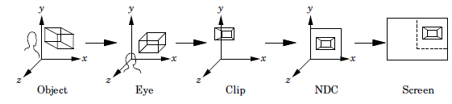
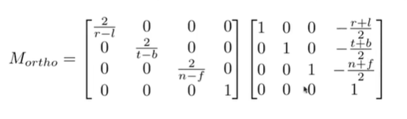
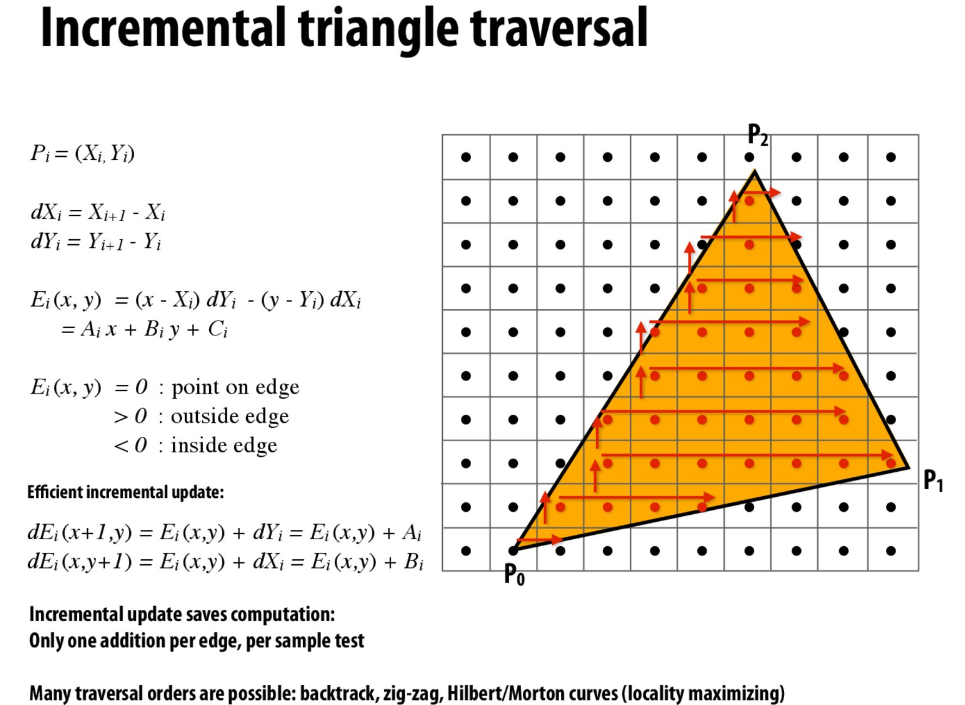
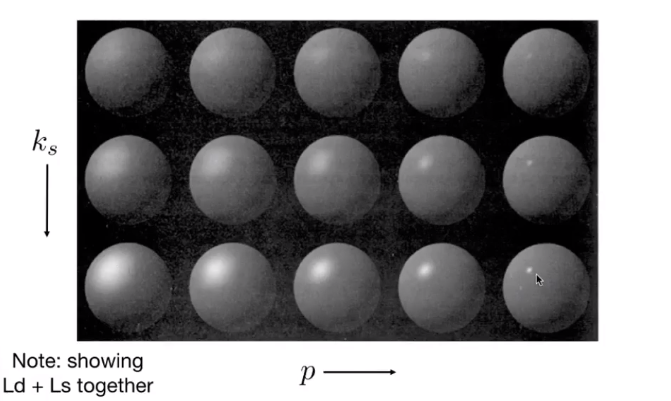
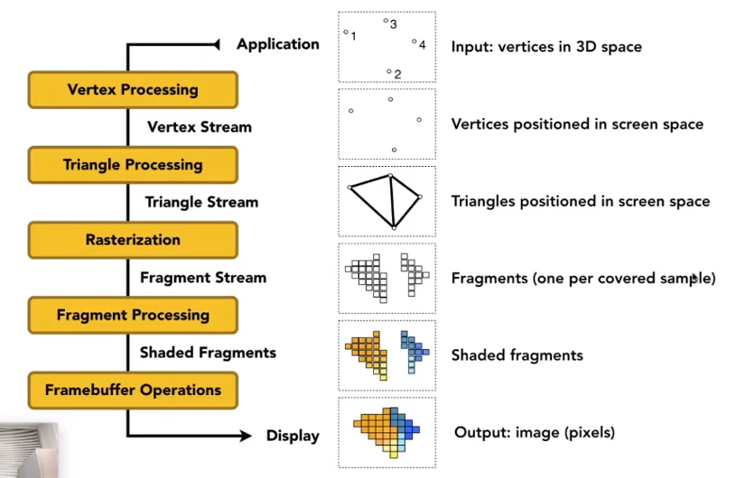
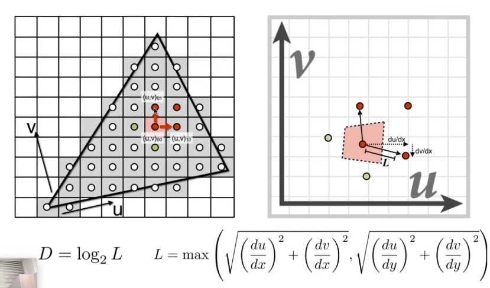

# Fundamental of Graphics
+ Background
  + Real Time
    + Frame per seconds
    + Refresh rates
+ OpenGL
  + from model to screen\
    
  + MVP matrix
    + ProjectionMatrix
      + orthognal or perspective
    + ViewMatrix
      + lookAt(camera position,rotation,direction)
    + ModelMatrix
    + P\*V\*M\*position    
+ Projections\
  + We wan to map a cubioid $[l,r]\times [b,t]\times[f,n]$ to the canoical cube $[-1,1]^3$
  + Orghographic Projection
  
  + Perspective Projection\
  $ M_{persp\rightarrow ortho}=\left( \begin{array}{cccc} 
                            n & 0 &0 & 0\\
                            0 &  n & 0& 0\\ 
                            0 & 0 & n+f &-nf\\
                            0 & 0 & 1 & 0
                        \end{array}\right) $
  + vertical field-of-view (fovY) and aspect ratio(assume symmetry l=-r,b=-t)\
    + aspect ratio = width/height = r/t
    $$ tan\frac{fovY}{2} = \frac{t}{|n|}$$
+ Rasterization
  + Canonical Cube to Screen
    + tranform in xy plane $[-1,1]^2$ to $[0,width]\times[0,height]$
  + LCD(Liquid Crystal Display) Pxiel
    + block or transmit light by twisting polarization
    + Illumination from backlight
    + Intermediate intensity levels by partial twist
  + Sampling
    + binary func: inside(tri,x,y)
      + equals 1 when pixel(x,y) inside triangle tri
        ```
        for (int x = 0; x < xmax; ++x)
          for (int y = 0; y < ymax; ++y)
              image[x][y] = inside(tri,x + 0.5,y + 0.5); 
        ```
      + Three Cross Product
      + Incremental triangle traversal
       
  + Antialiasing
    + Sampling Theory
      + Rasterization = sampling in 2D
      + behind aliasing artifacts:signals changes too fast(high-freq) but sampled too slowly
      + Blurring(Pre-Filtering) Before Sampling
      + 
       + Fourier Tranform
          + Series: represent a unction as a weighted sum of sines and cosines
          + Higher Frequencies need faster sampling
        + Filtering - Convolution
        + Sampling - repeating frequency contents
        + Supersampling MSAA
          + 
          + average NxN samples "inside" each pixel
        + FXAA
        + TAA
      + Visibility/Occulsion
        + Z-buffer
          + Painter's Algorithm
          + store current min z-value for each sample(pixel)
          + Additional buffer for depth values
          + z is always positive(smaller closer, larger further)
  + Shading
    + Applying material to an object
    + Shading is local
    + Blinn-Phong Refelctance Model
      + Lambert's cosine law\
        Light per unit area is proportional to $cos\theta = l\cdot n$
      + Intensity $I/r^2$
      + Lamberian(Diffuse) Shading
      
        $$L_d = k_d(I/r^2)max(0,n\cdot l)$$
        + $h = bisector(v,l)=\frac{v+h}{|v+h|}$, v close to mirror equals half vector near normal
        $$ L_s = k_s(I/r^2)max(0,cos\alpha)^p =k_s(I/r^2)max(0,n\dot h)^p$$
          + increasing narrows the reflection lobe
      + Ambient Term
        + Add costantcolor to account or disregardedillumination andfill in black shadows
        $$ L_a = k_aI_a$$
      
    + Shading Frequencies
      + Flat shaing
        + Triangle face is flat - one normal vector
        + not smooth
      + Gouraud shading
        + Interpolate colors froms vertices across triangle
        + Each vertex has avector
      + Phong shaidng
        + Interpolate normalvectors across each triangle
        + Compute full shading model at each pixel
  + Pipeline
  
    + Shader Programs
      + program vertex and fragment processing stages
      + Describe operation on a single vertex(or fragment)
      + shadertoy
  + Texture Mapping
    + Each triangle vertex is assigned a texture coordinate(u,v)
    + Texture can be used multiple times(tiled)
    + Interpolation across Triangles
      + Barycentric Coordinate
        + A coordinte system for triangles $(\alpha,\beta,\gamma)$
        $(x,y) = \alpha A +\beta B+ \gamma C,\alpha+\beta+\gamma=1$
          + inside the triangle if all three coordinates are non-negative
        + barycentric coordinates are note invariant under projection
    + Simple Texture Mapping
      ```
      for each rasterized screen sample (x,y):
          (u,v) = evaluae texture coordinate at(x,y)
          texcolor = texture.sample(u,v)\\usually diffuse albedo K_d
      ```
    + Texture Magnification
      + insufficient texture resolution
        + Bilinear interpolation
    + Too large - aliasing
      + from near to far :upsampling(magnification) to downsampling(minification)
      + Mipmap
        
        + allowing(fast,approx,square) range queries
        + Image Pyramid
        + D rounded to nearest integerer level
        + Trilinear Interpolaton
        + Limitations
          + overblur
          + Anisotropic Filtering
            + Ripmaps and summed area tables
              + Can look up axis-alighned rectangular zones
              + Diagonal footprints still a proble==m
          + EMA filtering
            + mult lookups
            + weighted verage
            + mipmap hieracrchy still help
            + handle irregular footprints.

        
  